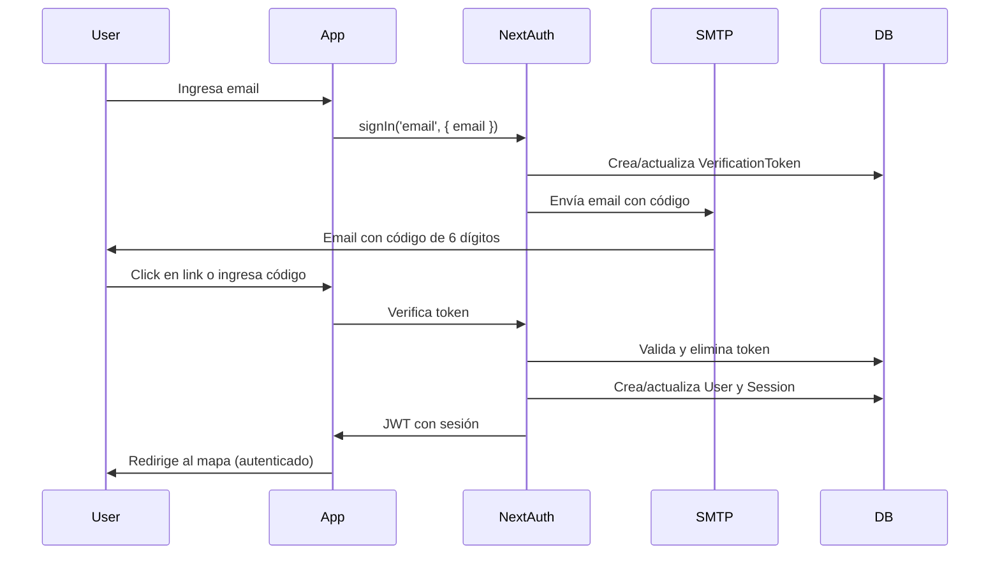

# 📧 Autenticación por Email

Este documento explica cómo configurar y usar la autenticación por correo electrónico con validación mediante código/token.

## 🎯 Características Implementadas

- ✅ Autenticación por email con código de verificación de 6 dígitos
- ✅ Tokens JWT para mantener la sesión (configuración de NextAuth)
- ✅ Emails personalizados con HTML y texto plano
- ✅ Rate limiting (máximo 3 intentos por hora)
- ✅ Expiración de tokens (24 horas)
- ✅ Endpoint para reenviar código de verificación
- ✅ Validación de seguridad

## 🔧 Configuración

### 1. Variables de Entorno

Agrega las siguientes variables a tu archivo `.env`:

```bash
# Configuración SMTP (elige tu proveedor)
SMTP_HOST="smtp.gmail.com"
SMTP_PORT="587"
SMTP_SECURE="false"
SMTP_USER="tu-email@gmail.com"
SMTP_PASSWORD="tu-app-password"
SMTP_FROM_EMAIL="noreply@estepona-tours.com"
SMTP_FROM_NAME="Estepona Tours"
```

### 2. Configuración de Gmail (Recomendado para desarrollo)

Si usas Gmail, necesitas crear una **App Password**:

1. Ve a tu cuenta de Google: https://myaccount.google.com/
2. Seguridad → Verificación en 2 pasos (actívala si no está)
3. Contraseñas de aplicaciones
4. Genera una nueva contraseña para "Mail"
5. Copia la contraseña de 16 caracteres
6. Úsala en `SMTP_PASSWORD`

### 3. Otros Proveedores SMTP

#### SendGrid (Producción recomendada)
```bash
SMTP_HOST="smtp.sendgrid.net"
SMTP_PORT="587"
SMTP_USER="apikey"
SMTP_PASSWORD="tu-sendgrid-api-key"
```

#### Outlook/Hotmail
```bash
SMTP_HOST="smtp-mail.outlook.com"
SMTP_PORT="587"
SMTP_USER="tu-email@outlook.com"
SMTP_PASSWORD="tu-contraseña"
```

#### Mailgun
```bash
SMTP_HOST="smtp.mailgun.org"
SMTP_PORT="587"
SMTP_USER="tu-usuario@mailgun.org"
SMTP_PASSWORD="tu-api-key"
```

## 🚀 Uso

### Iniciar Sesión con Email

Los usuarios pueden iniciar sesión usando el botón "Continuar con Email" en la página de inicio:

1. El usuario ingresa su email
2. Se genera un código de 6 dígitos
3. Se envía un email con el código y un link de verificación
4. El usuario puede:
   - Hacer clic en el botón del email (verificación automática)
   - Copiar el código de 6 dígitos e ingresarlo manualmente

### Formato del Email

El email incluye:
- 🎨 Diseño HTML responsive y atractivo
- 🔢 Código de 6 dígitos destacado visualmente
- 🔗 Botón para verificación automática
- ⏰ Información sobre expiración (24 horas)
- 🔒 Advertencias de seguridad

## 📡 API Endpoints

### Reenviar Código de Verificación

```typescript
POST /api/auth/resend-verification
Content-Type: application/json

{
  "email": "usuario@example.com"
}
```

**Respuesta exitosa:**
```json
{
  "message": "Código de verificación enviado correctamente"
}
```

**Rate limiting:**
- Máximo 3 intentos por hora por email
- Retorna 429 si se excede el límite

## 🔐 Seguridad

### JWT (JSON Web Tokens)

NextAuth está configurado con estrategia JWT:

```typescript
session: {
  strategy: 'jwt',
  maxAge: 30 * 24 * 60 * 60, // 30 días
}
```

Los tokens incluyen:
- ID del usuario
- Email
- Datos de sesión cifrados

### Protecciones Implementadas

1. **Rate Limiting**: Máximo 3 códigos por hora
2. **Expiración**: Códigos válidos por 24 horas
3. **Tokens únicos**: Generados con `crypto.randomBytes(32)`
4. **Limpieza automática**: Tokens antiguos se eliminan
5. **Validación de email**: Emails se almacenan en minúsculas
6. **Prevención de enumeración**: No se revela si un email existe

## 🧪 Pruebas

### Probar Email Localmente

Para desarrollo, puedes usar [Ethereal Email](https://ethereal.email/) (fake SMTP):

```bash
SMTP_HOST="smtp.ethereal.email"
SMTP_PORT="587"
SMTP_USER="tu-usuario-ethereal"
SMTP_PASSWORD="tu-password-ethereal"
```

Los emails no se envían realmente, pero puedes verlos en https://ethereal.email/messages

### Probar con el CLI

```bash
# Iniciar sesión con Stripe CLI
stripe login

# Escuchar webhooks
pnpm stripe:listen

# Iniciar aplicación
pnpm dev
```

## 🎨 Personalización

### Personalizar Plantilla de Email

Edita el archivo `lib/email.ts`:

```typescript
function getVerificationEmailTemplate(code: string, url: string): string {
  // Personaliza el HTML aquí
  return `...`;
}
```

### Cambiar Duración del Token

En `lib/auth.ts`:

```typescript
EmailProvider({
  // ...
  maxAge: 24 * 60 * 60, // Cambia aquí (en segundos)
})
```

## 📊 Monitoreo

Revisa los logs de la consola:

```
✅ Servidor SMTP listo para enviar emails
✅ Email de verificación enviado a: usuario@example.com
✅ Email de verificación enviado: <message-id>
```

Errores:
```
❌ Error en configuración SMTP: <error>
❌ Error al enviar email de verificación: <error>
```

## 🔄 Flujo Completo



## 🐛 Solución de Problemas

### Email no llega

1. Verifica la configuración SMTP en `.env`
2. Revisa los logs de la consola
3. Verifica que el puerto esté abierto (587 o 465)
4. Confirma que SMTP_USER y SMTP_PASSWORD sean correctos
5. Verifica spam/correo no deseado

### Error "Invalid login credentials"

- Regenera la App Password en Gmail
- Verifica que la verificación en 2 pasos esté activa

### Token expirado

- El token dura 24 horas
- Solicita un nuevo código usando el endpoint de reenvío

## 📚 Referencias

- [NextAuth Email Provider](https://next-auth.js.org/providers/email)
- [Nodemailer Documentation](https://nodemailer.com/)
- [JWT Best Practices](https://jwt.io/introduction)
- [Google App Passwords](https://support.google.com/accounts/answer/185833)

## 🎉 Ventajas sobre OAuth

✅ No requiere configuración de OAuth providers  
✅ No depende de servicios externos (Google, Apple)  
✅ Control total sobre la experiencia del usuario  
✅ Funciona sin JavaScript (fallback)  
✅ Privacidad: no se comparten datos con terceros  
✅ Fácil de implementar y mantener  

## 🔜 Mejoras Futuras

- [ ] Autenticación de dos factores (2FA)
- [ ] Recordar dispositivos confiables
- [ ] Notificaciones de inicio de sesión
- [ ] Rate limiting por IP
- [ ] Blacklist de dominios de email
- [ ] Internacionalización de emails (ES, EN, FR, DE, IT)
